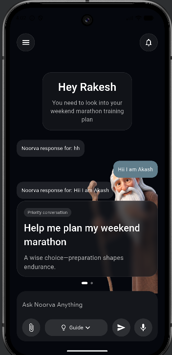
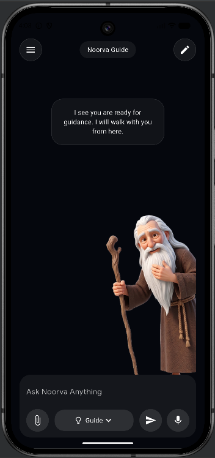

# Noorva Flutter Project

A Flutter implementation of Noorva UI task based on provided Figma design.

---

## ✨ Features

- Responsive UI
- GetX State Management
- Reusable Widgets
- Hero Animation
- Suggestion Slider
- Bottom Chat Input UI
- Google Sans Font Integration

---

## 📁 Folder Structure

lib/
│── core/
│── common_widgets/
│── features/
│── routes/

---

## 📱 Screenshots

### Home Screen


### Guide Screen


---

## 📦 APK Download

APK Link:

https://your-apk-link-here.com

---

## 🔗 GitHub Repository

https://github.com/your-username/noorva_flutter_project

---

## 🚀 Run Project

```bash
flutter pub get
flutter run